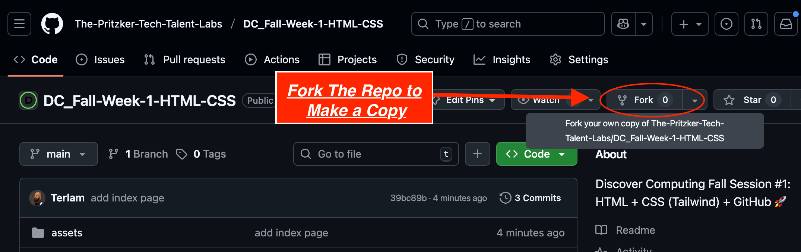
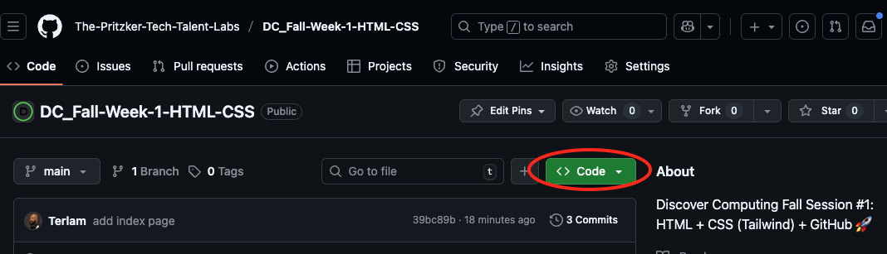
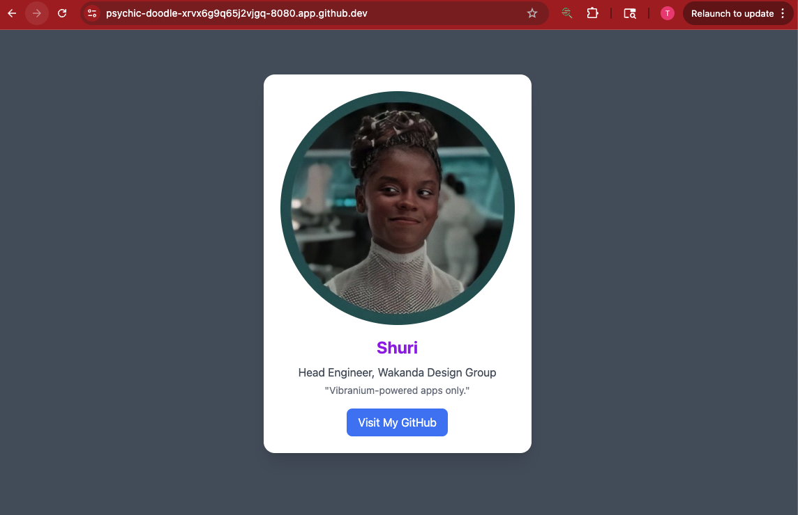
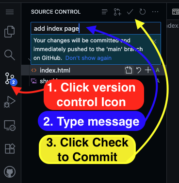
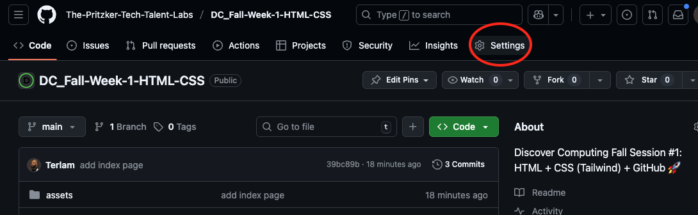
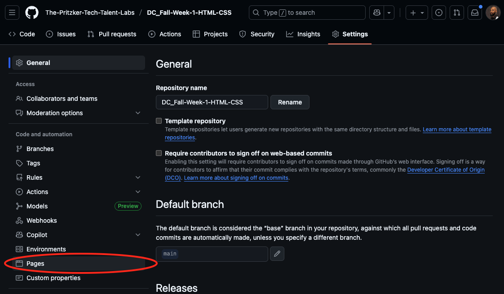
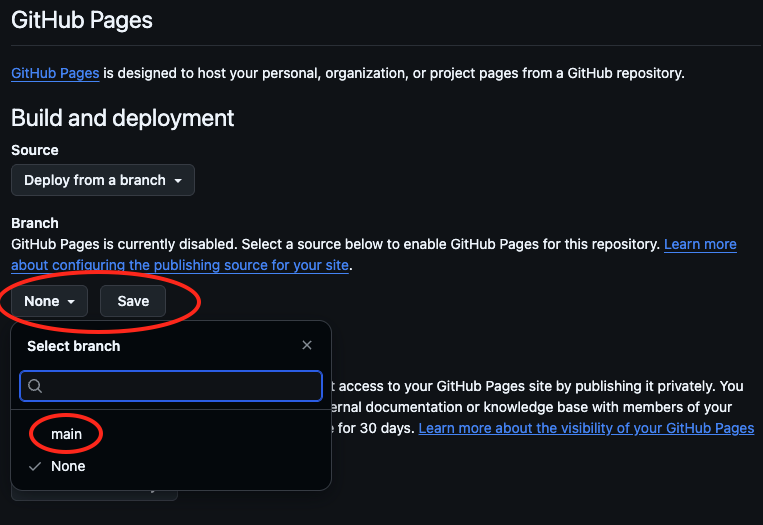
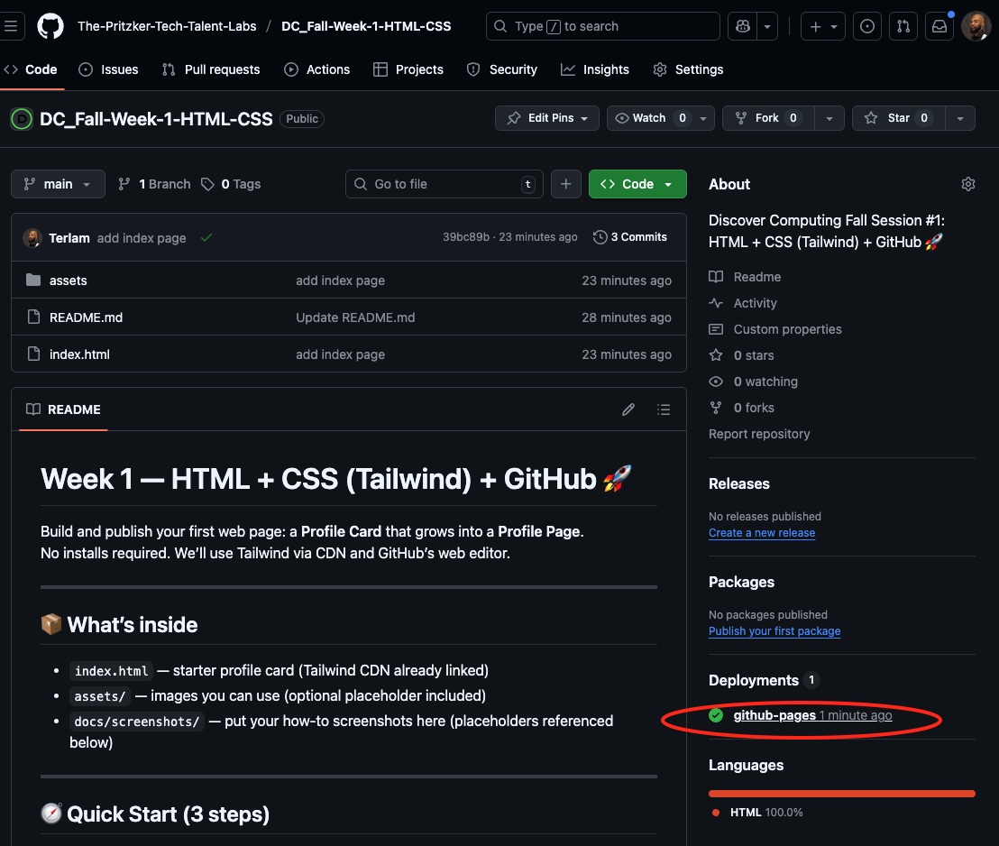
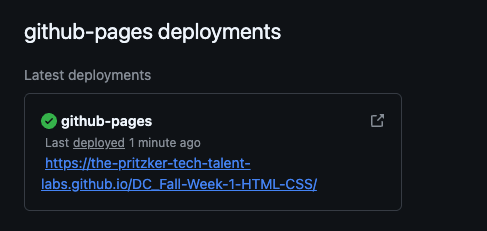

# Week 1 — HTML + CSS (Tailwind) + GitHub 🚀

Build and publish your first web page: a **Profile Card** that grows into a **Profile Page**.  
No installs required. We’ll use Tailwind via CDN and GitHub’s web editor.

---

## 📦 What’s inside
- `index.html` — starter profile card (Tailwind CDN already linked)
- `assets/` — images you can use (optional placeholder included)
- `docs/screenshots/` — put your how-to screenshots here (placeholders referenced below)

---

## 🧭 Quick Start (3 steps)

1. **Fork this repo** (top-right button)  
   _Screenshot placeholder:_ 

2. **Open in a GitHub Codespace**  
   - Click the green **“Code”** button → select the **Codespaces** tab → click **“Create codespace on main”**  
   - Wait for it to load (it’ll look like VS Code in your browser).  
   _Screenshot:_ 

3. **Start a Live Preview (Live Server)**  
   - In the Codespace terminal (bottom panel), type:  
     ```bash
     npx live-server
     ```  
   - After a few seconds, a preview panel or link will open (something like `https://<username>-<repo>-<id>.app.github.dev`)  
   - Every time you save your file, the page refreshes automatically.  
   _Screenshot:_ 


   - Make your changes! Add new sections, personalize your card. 
   - If you don't have an image have AI imagine one of you!
   - Click **Commit** in the source control sidebar.  
   _Screenshot:_ 

---

## 🌐 Publish with GitHub Pages (1 minute)

1. Go to **Settings → Pages**  
2. Under **Build and deployment**, set **Source = Deploy from a branch**  
3. Choose **Branch = `main`** and **Folder = `/ (root)`**, then **Save**  
4. Wait ~30s. Your site URL appears at the top of the Pages section.

_Screenshots:_  
  









> **[Submit your Portfolio Link Here](https://forms.gle/cBCUSPbZxeV5LEJx8)**

---

## 🧩 Mini Project (15 min): Profile Card

**Goal:** One centered card with an image, name, short bio, and a button that links to your GitHub.

Suggested changes:
- Replace the image with your own (or use `assets/shuri.jpg`)
- Try color classes: `text-blue-600`, `bg-violet-200`, `text-green-700`
- Add spacing: `p-6`, `mt-4`, `mb-2`
- Round things: `rounded-lg`, `rounded-full`
- Shadow: `shadow`, `shadow-lg`

---

## 🚀 Main Project (25–30+ min): Profile Page

Turn the card into a full **personal page**. Add sections:

```html
<!-- Example sections to add below your card -->
<section id="about" class="mt-8">…</section>
<section id="projects" class="mt-8">…</section>
<section id="contact" class="mt-8">…</section>
```

Ideas:
- Use a simple **grid or flex layout** for the Projects section
- Add buttons/links to other sites
- Create a color theme with consistent `text-*` and `bg-*` classes

**Stretch goals**
- Responsive tweaks: `md:grid md:grid-cols-2`
- Hover effects: `hover:scale-105`, `hover:bg-…`
- Dark mode toggle (bonus): swap classes on the `<body>`

---

## 🧠 Learn the Building Blocks

**HTML (structure)**
- `<div>` — invisible box for grouping content  
- `<h1>`–`<h3>` — headings/titles  
- `<p>` — paragraph text  
- `` — images  
- `<a href="">` — links (can look like buttons with classes)

**Tailwind CSS (style)**
- Color: `text-blue-600`, `bg-gray-100`
- Size: `text-2xl`, `w-1/2`
- Spacing: `p-6`, `m-4`, `mt-2`
- Layout: `flex`, `grid`, `justify-center`, `items-center`, `gap-4`
- Borders & rounding: `border`, `rounded-xl`
- Shadow: `shadow`, `shadow-lg`

---

## 🔗 Helpful References

**Tailwind CSS**
- Docs: https://tailwindcss.com/docs  
- Playground: https://play.tailwindcss.com/

**HTML & CSS Learning**
- MDN HTML Guide: https://developer.mozilla.org/en-US/docs/Web/HTML  
- MDN CSS Guide: https://developer.mozilla.org/en-US/docs/Web/CSS  
- HTML Elements Reference: https://developer.mozilla.org/en-US/docs/Web/HTML/Element

**Deploying**
- GitHub Pages Intro: https://pages.github.com/

---

## 🧑‍🤝‍🧑 Pair Programming Tips

- **Driver:** types the code  
- **Navigator:** reads instructions, spots mistakes, explains what’s happening  
- Switch every 5–7 minutes  
- Say errors **out loud** before fixing—debugging is a team sport

---

## 🤖 Optional: AI Assist (use wisely)

Prompts you can try:
- “Explain what this HTML tag does: ``.”  
- “Suggest 3 Tailwind class combos for a modern button.”  
- “Why isn’t my image showing? Here’s my code: …”  

> Always **read** the code it suggests and test small changes.

---

## ✅ Submission Checklist

- [ ] My site is live on GitHub Pages  
- [ ] `index.html` includes my name, image, and links  
- [ ] I added at least one extra section  
- [ ] I submitted my URL via the class form

---

## 🛠️ Troubleshooting

- **Pages 404?** Wait 1–2 minutes, then refresh.  
- **Styles not working?** Make sure the Tailwind CDN `<script>` is still in `<head>`.  
- **Broken image?** Check the URL and that `https://` is valid.  
- **Nothing centered?** Ensure the `<body>` has `min-h-screen flex items-center justify-center`.

---

## 📄 License

You may use this starter for learning and non-commercial demos.  
Replace or remove this section if your org has a standard license.
